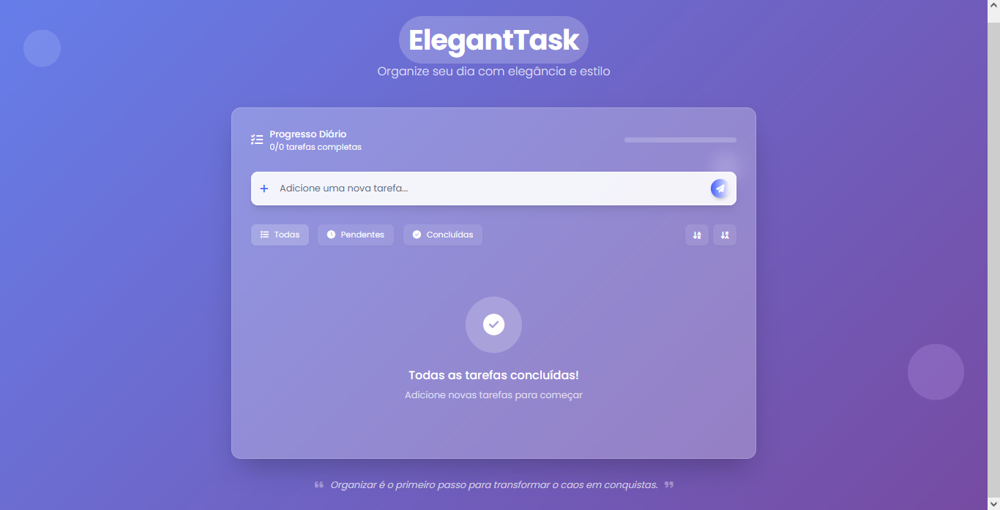

# 📝 ElegantTask - Lista de Tarefas Elegante

  
*Interface elegante e moderna para gerenciamento de tarefas diárias*

## ✨ Recursos Destacados

- 🎨 **Design Moderno** com efeito de vidro (glassmorphism)
- 📊 **Progresso Visual** com barra de progresso colorida
- 🔍 **Filtros Inteligentes** (Todas, Pendentes, Concluídas)
- 🔄 **Ordenação** alfabética (A-Z e Z-A)
- 💾 **Salvamento Automático** no localStorage
- 📱 **Totalmente Responsivo** para todos os dispositivos
- 🎭 **Animações Suaves** em todas as interações
- 🌈 **Cores Dinâmicas** que respondem ao progresso

## 🚀 Como Usar

1. Digite sua tarefa no campo "Adicione uma nova tarefa..."
2. Pressione Enter ou clique no botão ➕ para adicionar
3. Marque tarefas como concluídas clicando no círculo ✅
4. Use os botões de filtro para ver diferentes categorias
5. Edite tarefas clicando no ícone de lápis ✏️
6. Remova tarefas com o ícone de lixeira 🗑️

## ⚙️ Tecnologias Utilizadas

- **Tailwind CSS** - Framework de estilização
- **Font Awesome** - Ícones premium
- **Google Fonts** - Tipografia moderna
- **JavaScript Puro** - Funcionalidades dinâmicas
- **Glassmorphism** - Efeito de vidro translúcido
- **LocalStorage** - Armazenamento de dados

## 🎯 Funcionalidades Avançadas

- **Barra de progresso inteligente** que muda de cor conforme sua produtividade
- **Efeito de riscado animado** em tarefas concluídas
- **Sistema de classificação** por prioridade visual (cores das bordas)
- **Animações de entrada** para novas tarefas
- **Estado vazio personalizado** quando todas as tarefas estão concluídas
- **Citações inspiradoras** para motivar sua produtividade

## 🌈 Paleta de Cores

| Cor               | Uso Principal               |
|-------------------|-----------------------------|
| `#445FFF`         | Botões principais, destaques|
| `#8B5CF6`         | Elementos secundários       |
| `#7C3AED`         | Elementos ativos, progresso |
| `#EDEFFF`         | Fundos suaves               |
| Gradiente `#667eea` para `#764ba2` | Fundo principal |

---

## 💻 Desenvolvido Por

**Lalaio1**  
👨‍💻 GitHub: [github.com/lalaio1](https://github.com/lalaio1)  
📱 Telegram: [t.me/lalaio1](https://t.me/lalaio1)  

> "Organizar é o primeiro passo para transformar o caos em conquistas." ✨
